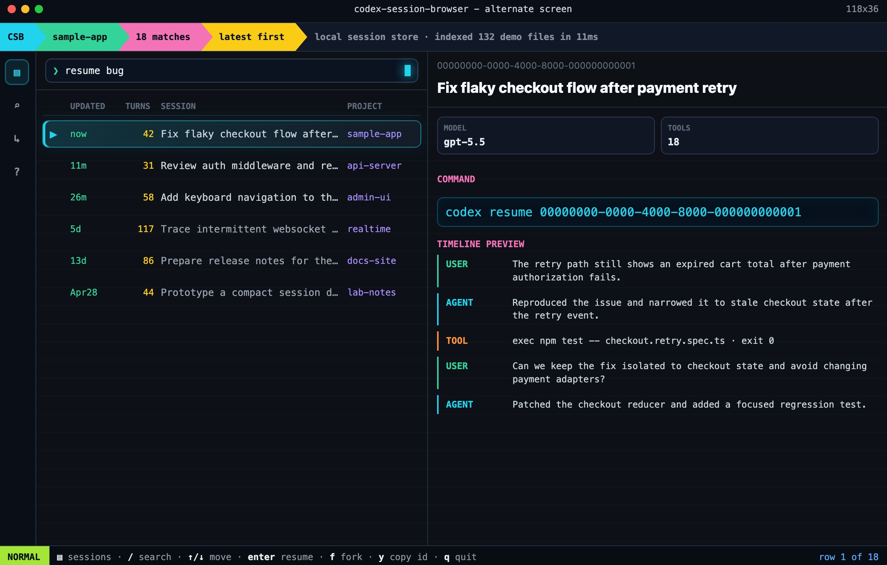

# codex-session-browser

Browse, search, and resume Codex CLI sessions from a terminal UI.



https://github.com/user-attachments/assets/9ae1f97f-9130-4d24-a89f-5882721bf46f

## Install

```bash
npm install -g codex-session-browser
```

Or with `npx` (no install):

```bash
npx codex-session-browser
```

Both expose two commands: `codex-session-browser` and the shorter alias `codex-sessions`.

## Usage

```bash
codex-sessions          # open the TUI for the current project
codex-sessions --all    # open the TUI across all projects
codex-sessions --cwd    # filter strictly to $PWD
```

## Keys

| Key | Action |
|---|---|
| `/` | enter search |
| `↑` `↓` | move selection (works in search too) |
| `Enter` | resume selected session |
| `f` | fork selected session |
| `y` | copy session id |
| `a` | toggle current-project / all-projects |
| `Esc` | clear search / exit search mode |
| `q` | quit |

## Development

```bash
git clone <repo>
cd codex-session-browser
node bin/codex-session-browser.js --all     # run directly
npm test                                    # run the test suite
```
